# Architecture Diagrams — Intelligent Institution Initiative

A working set of Mermaid diagrams for refining the system architecture. Each diagram isolates one architectural concern.

---

## 1. System Architecture

Unified TypeScript system with core and intelligence layers.

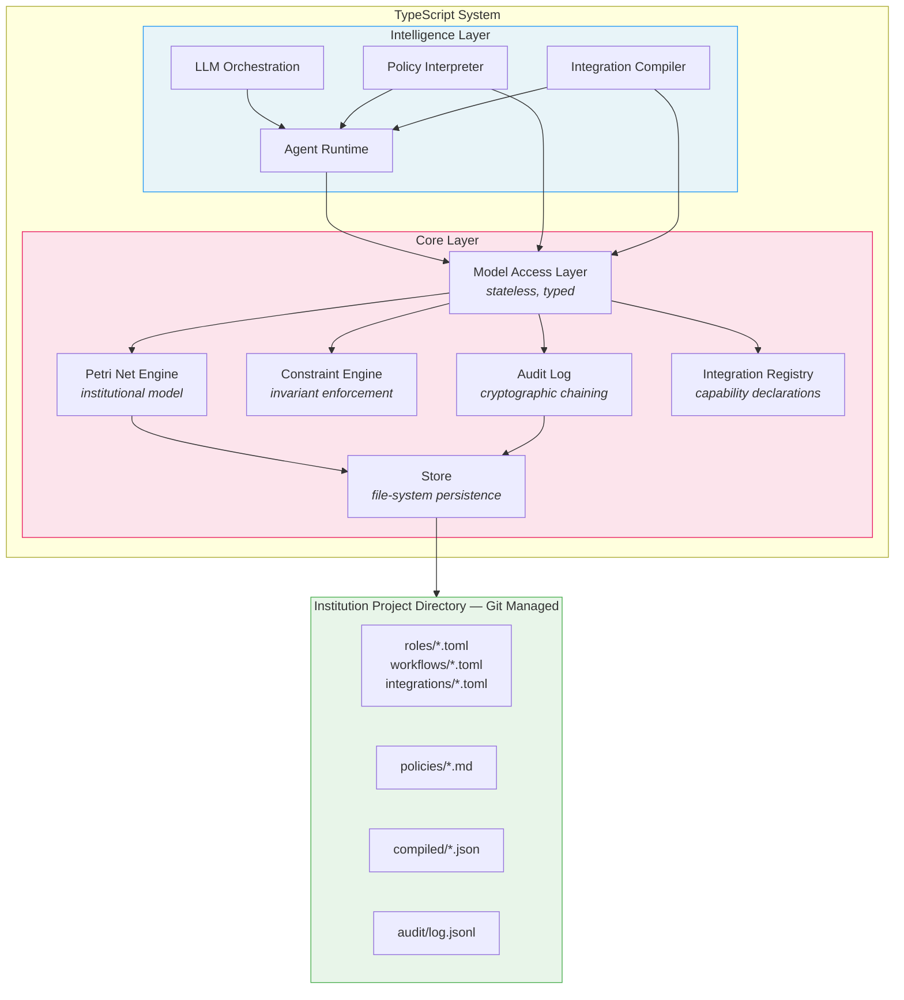

---

## 2. Formality Spectrum

Four stratified layers from hard constraints to tacit knowledge.

```mermaid
graph LR
    subgraph layer1["Layer 1: Constraints"]
        c_nature["Hard rules<br/>Legal/regulatory mandates"]
        c_repr["Typed predicates<br/>Formal logic"]
        c_enforce["Machine-enforced<br/>Compile-time + runtime"]
    end

    subgraph layer2["Layer 2: Procedures"]
        p_nature["Defined steps<br/>Authorized deviation"]
        p_repr["State machines<br/>Decision graphs"]
        p_enforce["Deterministic execution<br/>Logged overrides"]
    end

    subgraph layer3["Layer 3: Policies"]
        po_nature["Intent-bearing guidance<br/>Preferences"]
        po_repr["Structured natural language<br/>Semantic metadata"]
        po_enforce["LLM-interpreted<br/>At decision time"]
    end

    subgraph layer4["Layer 4: Context"]
        cx_nature["Tacit knowledge<br/>Institutional culture"]
        cx_repr["Unstructured<br/>natural language"]
        cx_enforce["LLM-referenced<br/>Advisory only"]
    end

    layer1 -->|"governs"| layer2
    layer2 -->|"guided by"| layer3
    layer3 -->|"informed by"| layer4

    llm["LLM as Interpreter"]
    llm -.->|"bridges"| layer3
    llm -.->|"bridges"| layer4
    llm -.->|"reads"| layer2

    style layer1 fill:#ffcdd2,stroke:#e91e63
    style layer2 fill:#ffe0b2,stroke:#ff9800
    style layer3 fill:#c8e6c9,stroke:#4caf50
    style layer4 fill:#bbdefb,stroke:#2196f3
    style llm fill:#f3e5f5,stroke:#9c27b0
```

---

## 3. Petri Net Execution Loop

The core engine cycle: find enabled transitions, fire via agent, verify postconditions.

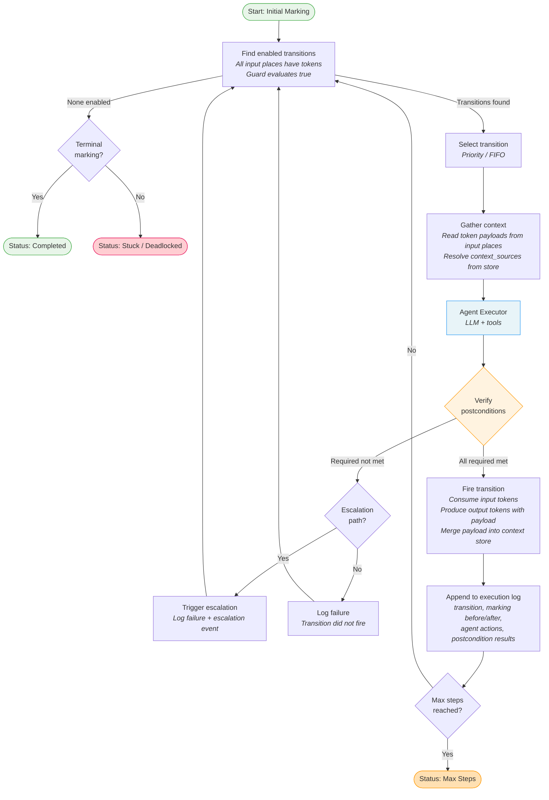

---

## 4. Agent Transition Execution

What happens inside the Agent Executor when a transition fires.

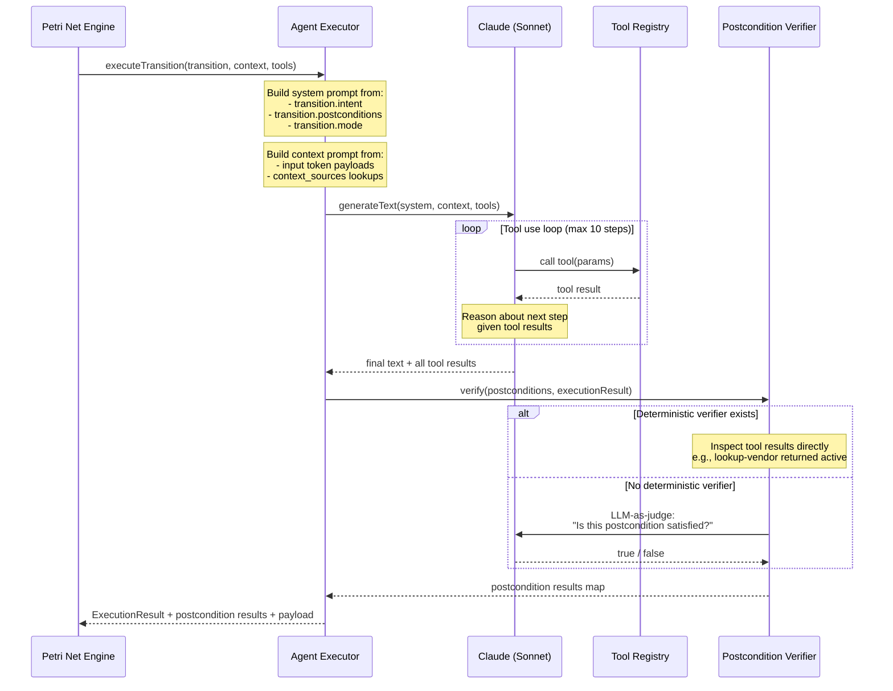

---

## 5. Postcondition Verification Strategy

Two-tier verification: deterministic checks first, LLM-as-judge fallback.

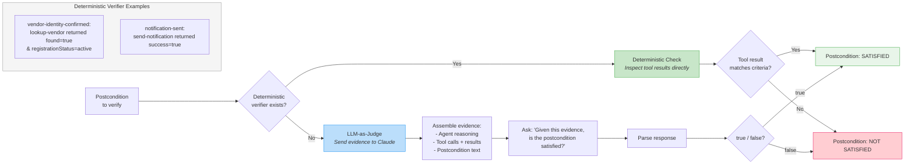

---

## 6. Policy Interpretation Flow

How policies are gathered, scoped, and applied at a judgment point.

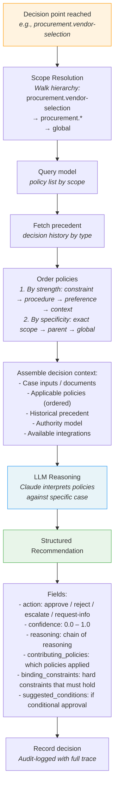

---

## 7. Edge Compilation Pipeline

How natural-language edge specs become executable automations.

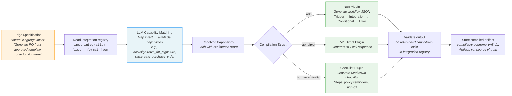

---

## 8. Vendor Onboarding — Petri Net

The concrete spike scenario as a Petri net with transition modes and tool bindings.

```mermaid
graph LR
    p1((("request-<br/>submitted<br/>🔵")))

    t1["verify-vendor<br/><i>mode: deterministic</i><br/><i>tools: lookup-vendor</i>"]

    p2((("vendor-<br/>verified")))

    t2["assess-risk<br/><i>mode: judgment</i><br/><i>tools: generate-document</i>"]

    p3((("risk-<br/>assessed")))

    t3["notify-compliance<br/><i>mode: agentic</i><br/><i>tools: send-notification</i>"]

    p4((("compliance-<br/>notified")))

    t4["approve-onboarding<br/><i>mode: judgment</i><br/><i>tools: generate-document</i>"]

    p5((("onboarding-<br/>approved<br/>🏁")))

    p1 -->|"consumes"| t1
    t1 -->|"produces<br/>+ vendor profile payload"| p2
    p2 -->|"consumes"| t2
    t2 -->|"produces<br/>+ risk assessment payload"| p3
    p3 -->|"consumes"| t3
    t3 -->|"produces<br/>+ notification confirmation"| p4
    p4 -->|"consumes"| t4
    t4 -->|"produces<br/>+ approval decision payload"| p5

    style p1 fill:#bbdefb,stroke:#2196f3
    style p2 fill:#f5f5f5,stroke:#9e9e9e
    style p3 fill:#f5f5f5,stroke:#9e9e9e
    style p4 fill:#f5f5f5,stroke:#9e9e9e
    style p5 fill:#e8f5e9,stroke:#4caf50
    style t1 fill:#fff3e0,stroke:#ff9800
    style t2 fill:#fce4ec,stroke:#e91e63
    style t3 fill:#e8f4f8,stroke:#2196F3
    style t4 fill:#fce4ec,stroke:#e91e63
```

---

## 9. Token Payload Data Flow

How data propagates through the net via colored tokens.

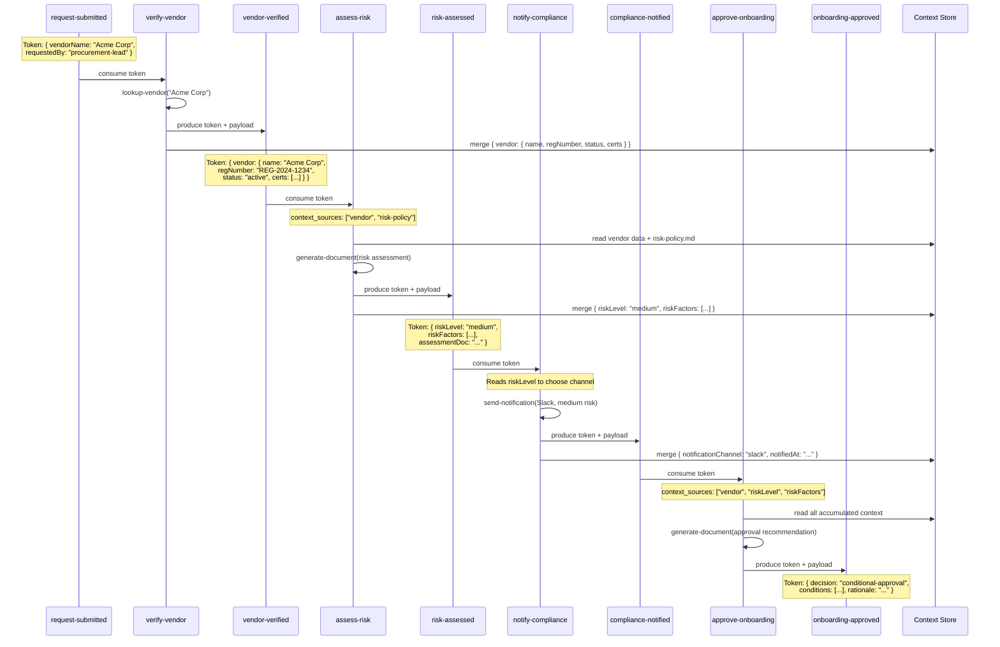

---

## 10. Progressive Adoption Stages

The four stages from codification to delegated agency.

```mermaid
graph TD
    subgraph s1["Stage 1: Codification"]
        s1a["Define institutional model<br/><i>Roles, authority, decisions, policies</i>"]
        s1b["Version control with git"]
        s1c["inst workflow validate"]
        s1d["Edge specs → human checklists"]
        s1val["Value: Clarity + traceability"]
    end

    subgraph s2["Stage 2: Decision Support"]
        s2a["Add TypeScript + LLM layer"]
        s2b["Context assembly at decision points"]
        s2c["Policy + precedent surfacing"]
        s2d["Structured recommendations"]
        s2val["Value: Better-informed human decisions"]
    end

    subgraph s3["Stage 3: Partial Automation"]
        s3a["Add integration registry"]
        s3b["Edge specs → n8n / API automations"]
        s3c["Deterministic steps run automatically"]
        s3d["Humans still make judgments"]
        s3val["Value: Reduced mechanical work"]
    end

    subgraph s4["Stage 4: Delegated Agency"]
        s4a["Agent operates with institutional authority"]
        s4b["Defined decision types delegated to AI"]
        s4c["Human oversight for exceptions"]
        s4d["Overrides logged + inform refinement"]
        s4val["Value: Scalable institutional judgment"]
    end

    s1 -->|"+ TypeScript layer"| s2
    s2 -->|"+ Integrations"| s3
    s3 -->|"+ Agent authority"| s4

    style s1 fill:#e8f5e9,stroke:#4caf50
    style s2 fill:#c8e6c9,stroke:#4caf50
    style s3 fill:#bbdefb,stroke:#2196f3
    style s4 fill:#e8f4f8,stroke:#2196F3
```

---

## 11. Decision Point Anatomy

The components of a judgment point and their relationships.

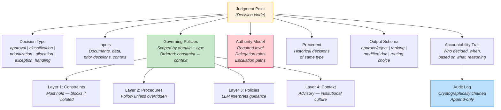

---

## 12. CPN Formal Execution — Agenda-Based Strategy

The formal workflow execution model from the CPN specification.

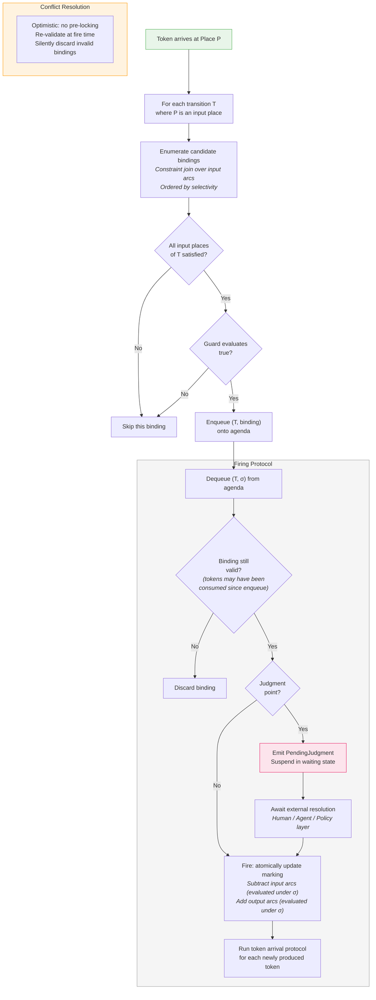

---

## 13. Component Dependency Map

How the TypeScript modules depend on each other.

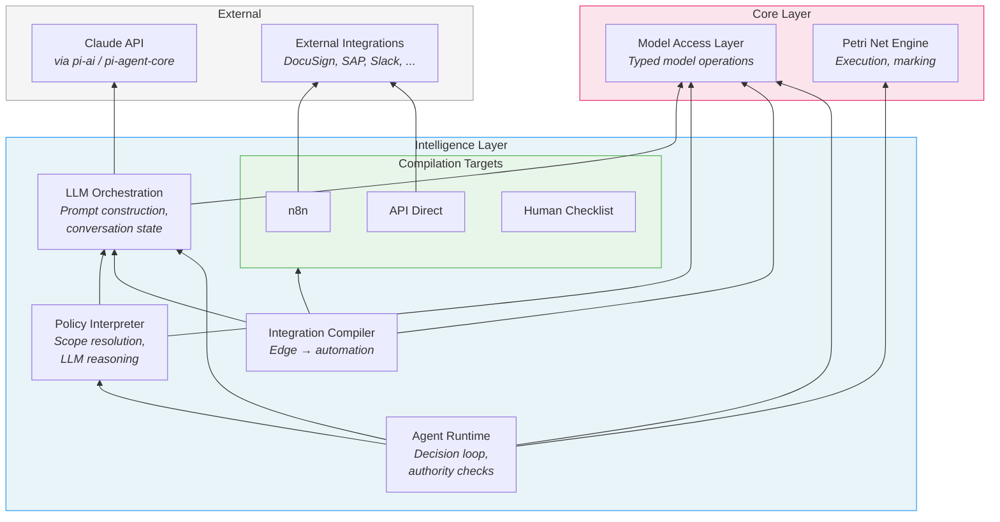

---

## Notes for Refinement

**Open questions these diagrams surface:**

1. **Diagram 3 (Execution Loop)**: The current spike uses simple FIFO selection. The formal CPN spec (Diagram 12) uses agenda-based execution. When does the spike engine evolve to agenda-based execution?

2. **Diagram 6 (Policy Interpretation)**: Policy conflict resolution is shown as simple ordering. Should there be an explicit conflict detection + LLM-mediated synthesis step?

3. **Diagram 7 (Edge Compilation)**: The "validate" step checks capabilities exist. Should it also check that the generated automation satisfies the edge's postconditions?

4. **Diagram 8 (Vendor Onboarding)**: This is a linear net. What does a branching scenario look like? (e.g., high-risk vendor triggers additional review path)

5. **Diagram 12 (CPN Formal Execution)**: Judgment points suspend and await external resolution. How does this interact with the Agent Runtime? Is the agent "external" from the engine's perspective?

6. **Missing diagram**: Multi-workflow interaction — how do tokens or decisions in one workflow affect another?
