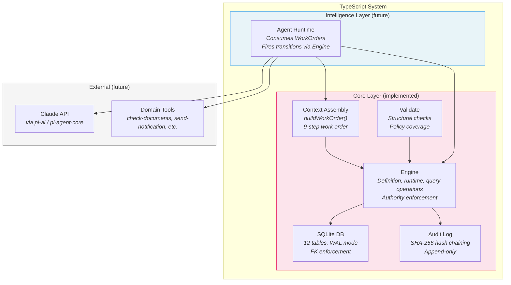
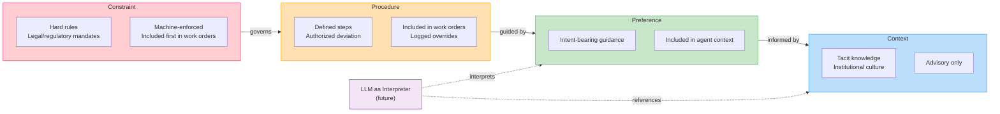
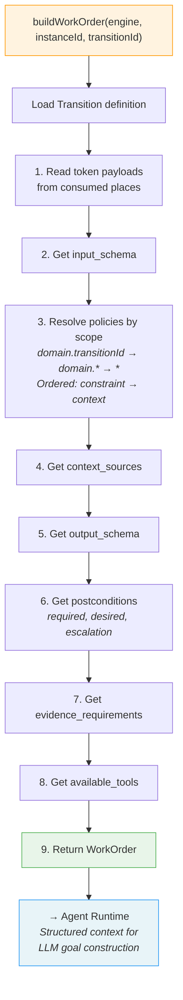
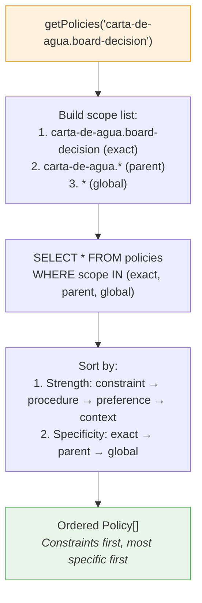
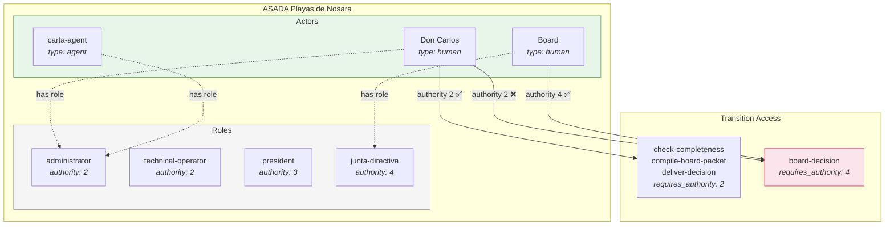
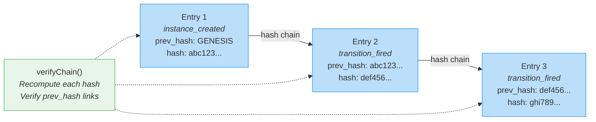
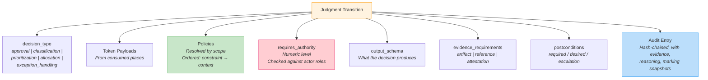
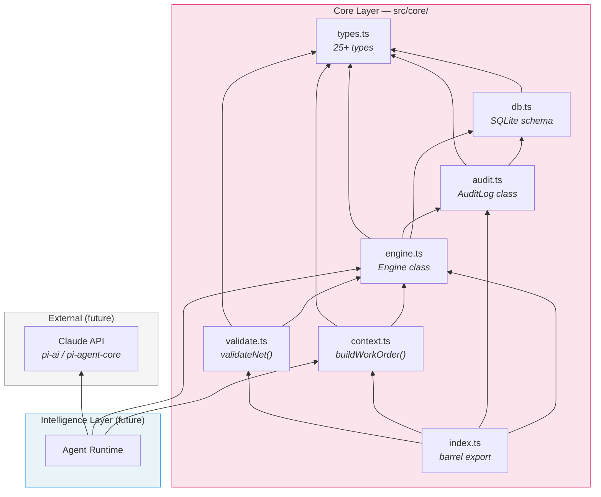

# Architecture Diagrams — Intelligent Institution Initiative

A working set of Mermaid diagrams for the system architecture. Each diagram isolates one architectural concern.

---

## 1. System Architecture

Unified TypeScript system with core engine and future intelligence layer.



---

## 2. Formality Spectrum

Four policy strengths from hard constraints to tacit knowledge.



---

## 3. Engine Firing Protocol

How `fireTransition` works: authority check → token check → atomic consume/produce/audit.

```mermaid
flowchart TD
    call["fireTransition(instanceId, transitionId, actorId, payload)"]

    call --> auth{"Actor authority<br/>≥ requires_authority?"}
    auth -->|"No"| reject_auth["Return: success=false<br/><i>Insufficient authority</i>"]
    auth -->|"Yes"| tokens{"All input places<br/>have tokens?"}
    tokens -->|"No"| reject_token["Return: success=false<br/><i>No token in input place</i>"]
    tokens -->|"Yes"| txn

    subgraph txn["SQLite Transaction (atomic)"]
        snapshot_before["Snapshot marking before"]
        snapshot_before --> consume["Consume tokens<br/><i>DELETE from input places</i>"]
        consume --> produce["Produce tokens<br/><i>INSERT to output places<br/>with output payload</i>"]
        produce --> snapshot_after["Snapshot marking after"]
        snapshot_after --> audit_write["Append audit entry<br/><i>Hash-chained, with evidence</i>"]
    end

    txn --> result["Return: FiringResult<br/><i>success=true, tokens consumed/produced,<br/>audit_entry_id</i>"]

    style txn fill:#f5f5f5,stroke:#9e9e9e
    style reject_auth fill:#ffcdd2,stroke:#e91e63
    style reject_token fill:#ffcdd2,stroke:#e91e63
    style result fill:#e8f5e9,stroke:#4caf50
```

---

## 4. Work Order Assembly

The 9-step context assembly from `buildWorkOrder()`.



---

## 5. Policy Scope Resolution

How policies are gathered and ordered at a judgment point.



---

## 6. Carta de Agua — Petri Net

The ASADA water availability letter process encoded as a CPN.

```mermaid
graph LR
    p1((("intake<br/>🔵")))
    t1["receive-request<br/><i>mode: deterministic<br/>authority: 2</i>"]
    p2((("documents-<br/>pending")))
    t2["check-completeness<br/><i>mode: agentic<br/>authority: 2</i>"]
    p3((("documents-<br/>complete")))
    t3["triage-case<br/><i>mode: judgment<br/>authority: 2</i>"]
    p4((("triaged")))
    t4["check-scarcity<br/><i>mode: deterministic<br/>authority: 2</i>"]
    p5((("technical-<br/>review-ready")))
    t5["compile-board-<br/>packet<br/><i>mode: agentic<br/>authority: 2</i>"]
    p6((("board-<br/>ready")))
    t6["board-decision<br/><i>mode: judgment<br/>authority: 4 🔒</i>"]
    p7((("decided")))
    t7["deliver-decision<br/><i>mode: agentic<br/>authority: 2</i>"]
    p8((("delivered<br/>🏁")))

    p1 --> t1 --> p2 --> t2 --> p3 --> t3 --> p4 --> t4 --> p5 --> t5 --> p6 --> t6 --> p7 --> t7 --> p8

    style p1 fill:#bbdefb,stroke:#2196f3
    style p8 fill:#e8f5e9,stroke:#4caf50
    style t1 fill:#fff3e0,stroke:#ff9800
    style t2 fill:#e8f4f8,stroke:#2196F3
    style t3 fill:#fce4ec,stroke:#e91e63
    style t4 fill:#fff3e0,stroke:#ff9800
    style t5 fill:#e8f4f8,stroke:#2196F3
    style t6 fill:#fce4ec,stroke:#e91e63
    style t7 fill:#e8f4f8,stroke:#2196F3
```



**Legend:** 🟠 deterministic | 🔵 agentic | 🔴 judgment | 🔒 board-only (authority 4)

---

## 7. Authority Model

How actors, roles, and authority levels gate transition firing.



---

## 8. Audit Chain

Cryptographic hash chaining for tamper-evident audit trail.



---

## 9. Decision Point Anatomy

The components of a judgment transition.



---

## 10. Component Dependency Map


